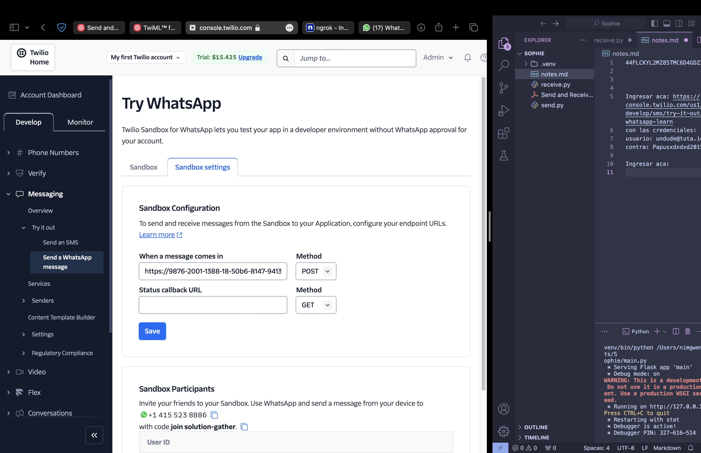

Ingresar aca: https://console.twilio.com/us1/develop/sms/try-it-out/whatsapp-learn
con las credenciales:
usuario: undude@tuta.io
contra: Papusxdxdxd2015!

Ingresar aca: 

Correr el script receive(crea el servidor webhook localmente)

Instalar ngrok y crearse una cuenta, buscar en documentacion, luego:
Correr el comando ngrok http 5000 (expone el servidor local a la web)
Copiar el link subrayado en rojo 

y pegarlo en lo subrayado en rojo

Si corres el script send.py enviaras un mensaje a mi numero xd, si quieren enviar 
a sus numeros tienen que agregar sus numeros al sandbox de twilio.

Si yo respondo, y tienen corriendo el servidor, entonces pueden ver mis respuestas en la interfaz del servidor que corre en el link subrayado en rojo:

